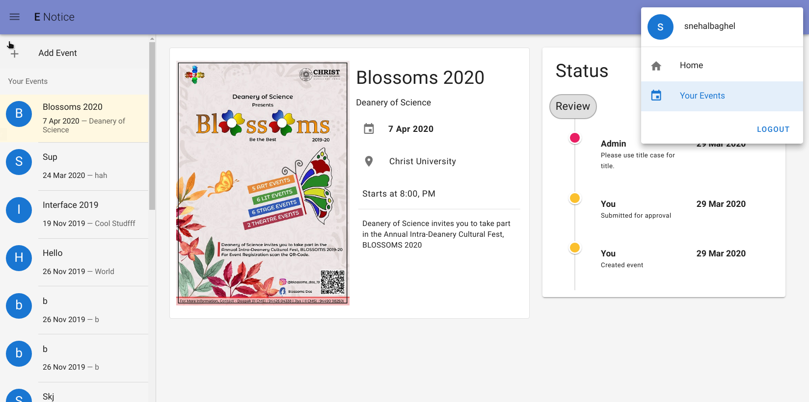

# E-Notice UI



## Project setup

Setup [enotice](https://github.com/snehalbaghel/enotice) server then

```
npm install && npm run serve
```

### Compiles and minifies for production
```
npm run build
```
